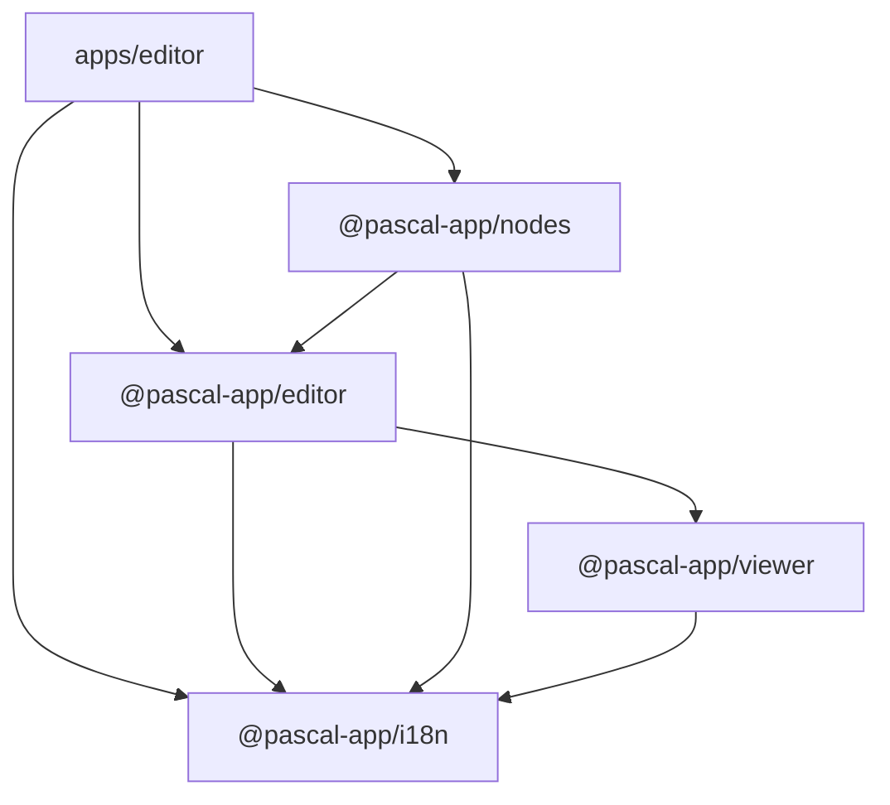

# Pascal Editor 中文国际化方案

## 1. 目标

为 Pascal Editor 增加可持续维护的简体中文界面，同时保留英文，并满足以下要求：

- 支持 `English` 与 `简体中文` 运行时切换，不刷新页面。
- 语言选择持久化，下一次打开时继续使用上次选择。
- 首次访问时优先读取已保存语言；没有记录时根据浏览器语言自动选择。
- 编辑器外壳、工具栏、建模工具、属性面板、快捷键提示、错误提示使用同一套翻译机制。
- 不让 Next.js 路由能力侵入可复用的 `viewer`、`editor`、`nodes` 包。
- 第三方插件即使没有中文资源，也能继续显示原有英文标签。
- 切换语言时不重建 WebGPU Canvas，不丢失当前场景和编辑状态。

首期只处理产品界面国际化，不翻译以下内容：

- 用户创建的项目名、楼层名、对象名和备注。
- 导入模型自带的名称及元数据。
- MCP 提示词、开发日志、测试描述和代码注释。
- 尺寸数值本身；单位名称和辅助说明需要翻译。

## 2. 当前情况

当前仓库没有 UI 国际化基础设施，界面文字主要直接写在：

- `apps/editor`：独立应用外壳、顶部工具栏、Build 面板。
- `packages/editor`：编辑器通用控件、侧栏、属性面板、命令和提示。
- `packages/nodes`：各类建筑构件的名称、参数、操作提示和面板内容。
- `packages/viewer`：少量查看模式、渲染状态和 GPU 降级提示。

初步扫描中，包含可见英文文本的 TypeScript/TSX 文件约为：

| 区域 | 文件数（粗略） | 特点 |
|---|---:|---|
| `apps/editor` | 23 | 数量少，但决定首屏完成度 |
| `packages/editor` | 309 | 通用编辑器 UI，复用范围大 |
| `packages/nodes` | 572 | 构件参数和工具提示最多 |
| `packages/viewer` | 76 | 应保持编辑器无关 |

仓库已有的 `@pascal-app/lingo` 用于自然语言尺寸解析，例如英尺、厘米和角度，不是 UI 翻译库，不能替代本次 i18n 系统。

## 3. 技术选型

### 结论

采用：

- `i18next`
- `react-i18next`
- 新建共享包 `@pascal-app/i18n`

### 为什么选择它

1. Pascal Editor 是跨多个 workspace 包复用的 React 组件系统，不只是一个 Next.js 网站。
2. `react-i18next` 可通过 Provider 向组件库传入独立 i18n 实例，适合当前 monorepo 和可嵌入编辑器形态。
3. 翻译资源可同步打包，不需要等待网络请求，也不会给 WebGPU 编辑器增加新的加载遮罩。
4. React 组件内可使用 Hook，React 外的展示描述可在渲染边界统一解析。
5. 第三方插件可保留现有英文 `label` 作为回退，不要求一次性改造所有插件。

### 暂不选择的方案

| 方案 | 不采用原因 |
|---|---|
| `next-intl` | 更适合以 Next.js 路由和服务端渲染为中心的网站；直接放进共享组件会让 `editor`、`viewer` 依赖 Next.js 运行上下文。 |
| `next-i18next` | 主要解决 Next.js 页面路由和服务端翻译加载，不符合当前客户端 3D 编辑器的核心需求。 |
| `@lingui/react` | 需要额外的消息提取和编译流程；当前仓库已有名为 `@pascal-app/lingo` 的尺寸解析依赖，命名上也容易混淆。 |
| 自制 Context + 对象字典 | 初期简单，但复数、插值、命名空间、缺失键检查和插件扩展会很快重复造轮子。 |

官方参考：

- [react-i18next Quick Start](https://react.i18next.com/guides/quick-start)
- [I18nextProvider](https://react.i18next.com/latest/i18nextprovider)
- [useTranslation](https://react.i18next.com/latest/usetranslation-hook)

## 4. 架构设计

新增一个不依赖 Pascal 业务包的叶子包：

```text
packages/i18n/
├── package.json
├── tsconfig.json
└── src/
    ├── index.ts
    ├── provider.tsx
    ├── instance.ts
    ├── locale.ts
    ├── types.ts
    ├── registry.ts
    ├── default-instance.ts
    └── locales/
        ├── en/
        │   ├── common.json
        │   ├── editor.json
        │   ├── nodes.json
        │   └── viewer.json
        └── zh-CN/
            ├── common.json
            ├── editor.json
            ├── nodes.json
            └── viewer.json
```

依赖方向：



边界规则：

- `packages/core` 不依赖 React 和 i18next。
- `packages/mcp` 不接入 UI 翻译。
- `packages/viewer` 只依赖独立的 `@pascal-app/i18n`，继续保持对 `editor` 无感知。
- `packages/nodes` 和 `packages/editor` 使用宿主传入的同一 Provider 实例，不各自创建可修改的全局语言状态。
- `apps/editor` 拥有独立稳定的 i18n 实例，负责决定初始语言、安装 Provider 并提供切换入口。
- 不暴露会修改模块级单例的全局 `setPascalLocale()`，避免多编辑器实例、SSR 或第三方嵌入时串扰。
- 独立使用 `@pascal-app/viewer` 且没有安装 Provider 时，使用只读的英文默认实例，不报错、不显示原始翻译 key。

依赖约束：

- `@pascal-app/i18n` 将 `react` 声明为 peer dependency，避免出现两份 React。
- `i18next` 和 `react-i18next` 作为 `@pascal-app/i18n` 的直接 dependency；其他 Pascal 包只从 `@pascal-app/i18n` 导入封装后的 Hook 和 Provider。
- `@pascal-app/i18n` 作为公开发布包输出 `dist`，不依赖 Next.js、Pascal 业务包或浏览器全局对象。

## 5. 公共 API

`@pascal-app/i18n` 对外提供：

```ts
type PascalLocale = 'en' | 'zh-CN'
type PascalI18nInstance

createPascalI18n({ initialLocale, resources? })
PascalI18nProvider({ instance, children })
usePascalTranslation(namespace?)
usePascalLocale() // { locale, setLocale }
resolveLocalizedLabel(descriptor, t)
registerPascalTranslations(instance, bundle)
unregisterPascalTranslations(instance, pluginId)
SUPPORTED_LOCALES
```

实例所有权规则：

- 宿主通过 `createPascalI18n()` 创建实例，Provider 只接收该实例，不在渲染时隐式新建。
- `ClientBootstrap` 使用 `useState(() => createPascalI18n(...))` 或等价的稳定引用，确保普通重渲染不会更换实例。
- 组件内通过 `usePascalLocale().setLocale()` 切换语言；需要从 React 外部切换时，由宿主保留实例并调用实例方法。
- 包内可以保留一个仅供无 Provider 场景读取英文的默认实例，但不对外提供修改它的 API。

Provider 采用同步内置资源：

- `fallbackLng: 'en'`
- `supportedLngs: ['en', 'zh-CN']`
- `defaultNS: 'common'`
- `react.useSuspense: false`
- `interpolation.escapeValue: false`
- 开发环境报告缺失翻译键，生产环境回退英文。

不使用 HTTP backend，避免语言包网络请求影响编辑器首屏和离线运行。

## 6. 语言初始化与持久化

### 独立 Next.js 应用

为了避免服务端先输出英文、客户端再切换中文造成闪烁或 hydration 不一致，首屏语言由服务端决定。

服务端优先级：

1. Cookie `pascal.locale`。
2. 请求头 `Accept-Language`。
3. 默认英文 `en`。

`RootLayout` 负责：

- 归一化语言后输出 `<html lang={initialLocale}>`。
- 将同一个 `initialLocale` 传入 `ClientBootstrap`，保证服务端 HTML 和 hydration 首帧文案一致。
- 接受该 layout 因读取 Cookie/请求头成为请求相关渲染；本地编辑器不以纯静态导出为目标。

切换语言时：

- 同时更新 Cookie `pascal.locale`、`localStorage['pascal.locale']` 和 `document.documentElement.lang`。
- Cookie 是下次 SSR 的权威来源；`localStorage` 仅作为客户端嵌入场景的持久化辅助，不在 hydration 首帧覆盖服务端语言。

### 非 Next.js 嵌入宿主

- 宿主显式向 `createPascalI18n()` 传入 `initialLocale`。
- 宿主可以在客户端使用 `detectBrowserLocale()` 读取 `navigator.languages`，但不把该逻辑强制写进公共组件的首次渲染。

通用规则：

- `zh`、`zh-CN`、`zh-SG` 归一到 `zh-CN`。
- 其他语言首期回退到 `en`。
- Provider 的 React 节点保持稳定，不能通过 `key={locale}` 强制重挂载。
- 切换语言只触发文案重新渲染，不能清空 Zustand、IndexedDB 或 Three.js 场景。

## 7. 翻译键设计

使用语义键，不使用整句英文作为 key：

```json
{
  "toolbar.view.3d": "3D",
  "toolbar.view.2d": "2D",
  "toolbar.view.split": "分屏",
  "toolbar.sidebar.collapse": "收起侧栏",
  "toolbar.sidebar.expand": "展开侧栏"
}
```

命名空间建议：

| Namespace | 内容 |
|---|---|
| `common` | 保存、取消、删除、开关、方向、单位等通用词 |
| `editor` | 工具栏、侧栏、命令面板、提示、场景列表 |
| `nodes` | 墙、门、窗、屋顶、暖通等构件及参数面板 |
| `viewer` | 视图模式、渲染、相机、WebGPU 降级提示 |

动态内容使用插值：

```ts
t('editor:levels.mode', { mode: t(`editor:levels.${levelMode}`) })
t('common:count.items', { count })
```

类型安全策略：

- 英文资源是内置翻译键的规范源，`zh-CN` 必须与其保持同结构。
- 通过 i18next `CustomTypeOptions` 模块增强或构建时生成的 `PascalBuiltInKey`，让内置 Hook 对错误 key 提供 TypeScript 报错。
- 动态第三方插件 key 保留字符串扩展能力，但必须经过命名空间注册和运行时回退。
- CI 中比较各语言的扁平 key 集合，发现缺失、多余或值类型不一致时失败。

## 8. Registry 和插件兼容

大量工具名称来自静态 node registry，不能在模块加载时直接调用 `t()`，否则切换语言后不会更新。

建议给展示描述增加可选键，但继续保留原英文：

```ts
presentation: {
  label: 'Wall',
  labelKey: 'nodes:kinds.wall',
  descriptionKey: 'nodes:kinds.wallDescription'
}
```

渲染时按以下优先级解析：

1. 当前语言中的 `labelKey`
2. 英文资源中的 `labelKey`
3. 插件原有 `label`
4. `kind`

这样可以保证：

- 内置节点完整中文化。
- 第三方插件不改代码也不会显示空白或翻译 key。
- 语言切换发生在渲染边界，静态 registry 无需重建。

第三方插件资源注册 API：

```ts
registerPascalTranslations(instance, {
  pluginId: 'example-plugin',
  namespace: 'plugin-example-plugin',
  resources: {
    en: { kinds: { beam: 'Beam' } },
    'zh-CN': { kinds: { beam: '梁' } }
  }
})
```

注册规则：

- `common`、`editor`、`nodes`、`viewer` 是内置保留 namespace，插件不能覆盖。
- 插件使用 `plugin-<pluginId>` namespace；资源只注册到传入的 `PascalI18nInstance`，不写入模块级全局状态。
- 同一插件或 namespace 重复注册时，开发环境抛出明确错误，生产环境记录警告并保持首次注册结果。
- 插件卸载时调用 `unregisterPascalTranslations()` 清理其资源。
- 插件未提供当前语言时，先回退插件英文资源，再回退 `presentation.label`，最后才使用 `kind`。
- 内置 key 接受编译期类型检查；插件 key 因动态加载使用运行时校验。

`packages/core` 只给 `Presentation` 增加可选的 `labelKey` 和 `descriptionKey` 字符串字段，继续要求原英文 `label`；不导入 i18n 库，也不改变场景序列化格式。

## 9. 语言切换入口

实际位置：左侧 `Settings` 页签中的内置 Settings 面板。

实施期间通过真实浏览器确认：`Editor` 会对 `sidebarTabs` 中的 `id: 'settings'` 做专门处理，直接渲染 `packages/editor` 内置的 `SettingsPanel`，传入该页签的 `component` 不会成为实际内容。因此语言选择器不能放在应用层的独立 `settings-tab.tsx` 中，否则代码存在但界面不会使用。

已加入：

- `Languages` 图标和“界面语言”分组。
- `简体中文` / `English` 下拉选择。
- 选择后即时生效，不刷新页面。
- 与现有音频、快捷键、加载工程设置共用同一滚动面板。

不把语言按钮放在顶部 3D 画布工具栏，避免占用建模操作空间。

真实实现位置：

```text
packages/editor/src/components/ui/sidebar/panels/settings-panel/index.tsx
apps/editor/app/page.tsx
apps/editor/app/client-bootstrap.tsx
apps/editor/app/layout.tsx
apps/editor/lib/server-locale.ts
```

`RootLayout` 在服务端读取初始语言并直接输出正确的 `lang`；Settings 切换器只修改现有实例，不通过刷新、路由跳转或组件 `key` 重建编辑器。

## 10. 首期翻译范围

### 阶段 A：基础设施和首屏

- Provider、语言检测、持久化、类型定义。
- Settings 中的语言切换器。
- 首页本地编辑器提示。
- Scene / Build / Items / Settings 页签。
- 3D / 2D / Split。
- Stack / Exploded / Solo。
- Full height / Cutaway / Low / Translucent。
- Display / Preview 及显示菜单。
- Wall、Fence、Slab、Ceiling、Roof、Door、Window、Stairs、Elevator 等 Build 图块。
- 鼠标和相机操作提示。
- 底部 Select、Zone、Measure、Delete 等主要工具。

完成阶段 A 后，打开编辑器首屏不应再出现明显的英文功能标签。

### 阶段 B：通用编辑器组件

- 侧栏与场景树。
- Items 和材质面板。
- 命令面板。
- 浮动操作菜单。
- 属性控件公共标题。
- 保存状态、Toast、确认对话框和错误提示。
- 2D 平面图工具。

### 阶段 C：内置节点

按使用频率迁移：

1. Wall / Door / Window / Slab / Ceiling / Roof。
2. Stair / Elevator / Column / Fence / Shelf。
3. HVAC、Duct、Lineset、Liquid Line、Pipe 等 MEP 节点。
4. Roof accessories、Zone、Guide、Scan、Measurement。

每个节点应覆盖：

- 节点名称。
- 参数分组。
- 枚举选项。
- 操作按钮。
- 工具提示和快捷键说明。
- 校验错误。

### 阶段 D：收尾

- 扫描遗漏硬编码英文。
- 补齐可访问性文本，如 `aria-label`、图片 `alt` 和 Tooltip。
- 检查中英文下的布局宽度。
- 建立缺失翻译检查脚本。

## 11. 建筑专业术语基线

首版统一采用以下术语，避免逐文件自由翻译：

| English | 简体中文 |
|---|---|
| Wall | 墙体 |
| Fence | 围栏 |
| Slab | 楼板 |
| Ceiling | 天花板 |
| Roof | 屋顶 |
| Stair | 楼梯 |
| Elevator | 电梯 |
| Door | 门 |
| Window | 窗 |
| Column | 柱 |
| Zone | 空间区域 |
| Cutaway | 剖切 |
| Exploded | 分层展开 |
| Full height | 全高显示 |
| MEP | 机电系统 |
| HVAC Unit | 暖通设备 |
| Duct | 风管 |
| Register | 风口 |
| Lineset | 冷媒管组 |
| Liquid Line | 液管 |
| DWV Pipe | 排水通气管 |
| Snapping | 捕捉 |
| Grid | 网格 |

专业术语表应独立维护，后续可以由产品或工程人员审核，不在组件中出现同一术语的多种译法。

## 12. 构建与发布设计

新增的 `@pascal-app/i18n` 不是仅供 monorepo 内部使用的私有包。由于已发布的 `viewer`、`editor` 和 `nodes` 都会依赖它，因此必须进入正式构建、版本和 npm 发布链路。

### 包配置

`packages/i18n/package.json` 至少包含：

- `main`、`types` 和 `exports` 指向 `dist`。
- `files: ['dist', 'README.md']`。
- `build: 'tsc --build'`，沿用仓库现有 TypeScript 构建方式。
- `prepublishOnly` 执行构建和单元测试。
- `react` 放入 peer dependencies。
- `i18next`、`react-i18next` 放入 dependencies。
- 发布 ESM 中的内部相对导入必须带 `.js` 扩展名；JSON 语言资源使用标准 `with { type: 'json' }` 导入属性，保证 Node ESM 与浏览器打包器都能加载。

`packages/i18n/tsconfig.json` 使用 `composite: true`、`noEmit: false` 和 `outDir: 'dist'`。引用该包的 `viewer`、`nodes` 等 composite 工程要增加 TypeScript project reference；各包的 `package.json` 同时声明真实依赖，让 Turbo 能按依赖图确定构建顺序。

### 发布工作流

必须同步修改：

- 根 `package.json`：增加 `release:i18n`。
- `.github/workflows/release.yml`：在手动发布选项、版本数组、依赖版本同步循环和发布步骤中加入 `i18n`。
- `bun.lock`：记录新增依赖和 workspace 包。
- 发布顺序：`core → i18n → viewer → editor → nodes`，其余包继续按现有依赖关系发布。
- `package=all` 时先发布 `i18n`，再发布依赖它的包；单独发布消费者前，要确认 npm 上已有满足其版本范围的 `@pascal-app/i18n`。

发布前使用 `npm pack --dry-run` 和一个仓库外临时消费者做冒烟验证，确认：

- 包内确实包含 JavaScript、类型声明和内置语言资源。
- 仅安装公开依赖后可以导入 `@pascal-app/i18n`。
- `@pascal-app/viewer` 在有 Provider 和无 Provider 两种模式下都能启动。
- 发布产物不会引用 monorepo 源码路径或未发布的 workspace 协议。

## 13. 测试与验收

### 自动检查

- `bun run check:i18n`
- `bun run check-types`
- `bun run build`
- `bun run check`（全仓库格式/静态规则；需要区分历史基线问题与本次回归）
- i18n 单元测试：语言归一、英文回退、插值、缺失 key 和实例级切换。
- 实例隔离测试：两个 Provider 使用两个实例时，切换其中一个不会影响另一个。
- 默认实例测试：独立 Viewer 没有 Provider 时正常显示英文。
- SSR 测试：服务端语言、`<html lang>` 和 hydration 首帧保持一致。
- Registry 标签解析测试：有当前语言 key、有英文 key、仅有原始 label、最终 kind 回退。
- 插件资源测试：注册、卸载、保留 namespace 冲突和重复注册。
- 语言资源检查：英文与中文 key 集合、层级和值类型完全一致。
- 发布产物检查：`npm pack --dry-run` 和临时消费者导入测试。

### 硬编码文字检查

增加 `scripts/check-i18n.ts` 或等价检查：

- 扫描已经纳入迁移范围的 `apps/editor`、`packages/editor`、`packages/nodes` 和 `packages/viewer`。
- 对 JSX 文本、`title`、`aria-label`、Tooltip、Toast、错误提示和展示用 `label` 建立检查规则。
- 技术标识、文件格式、品牌名、测试夹具和用户数据使用明确 allowlist，不把所有英文字符机械判定为错误。
- 新增用户可见硬编码英文时 CI 失败，防止后续回退。

### 浏览器验收

在 `http://localhost:3002/` 使用真实 Chrome 验证：

- 首次访问语言符合 Cookie 或浏览器请求语言，首屏没有英文闪烁。
- 切换中文后不刷新页面。
- WebGPU Canvas 不重建、不空白。
- 当前选中对象、相机位置和撤销栈不丢失。
- 刷新后语言保持。
- 1280×720、1440×900、1920×1080 下文字不遮挡。
- 中文 Tooltip、菜单和参数名无溢出。
- 控制台没有缺失翻译键、Provider 警告和 hydration 错误。
- 同页挂载两个独立编辑器实例时语言状态不会互相污染。
- 独立 Viewer 不安装 Provider 时仍能显示英文界面。

### 首期完成标准

- 阶段 A 列出的首屏操作区全部使用翻译 key，中文模式下不出现遗漏的英文功能标签。
- 所有内置英文 key 都存在对应的 `zh-CN` key；CI 不允许缺失、多余或类型不一致。
- 已迁移目录不再新增未列入 allowlist 的用户可见硬编码英文。
- 任意缺失翻译可靠回退英文原文，不显示原始翻译 key。
- 第三方插件没有语言资源时继续显示原有英文 `label`；有资源时可以按实例注册和卸载。
- 切换语言不重建 Canvas，不清空 Zustand、IndexedDB、场景、相机和撤销栈。
- 不增加异步语言包请求，也不引入可观察的 3D 性能回退。

不再使用无法稳定计算的“95% 文件覆盖率”作为验收条件；完成度由翻译 key 对齐、硬编码扫描和真实界面走查共同判定。

## 14. 推荐实施顺序

1. 确认术语表和首期迁移范围，保存当前英文界面截图作为基线。
2. 新建可构建、可发布的 `@pascal-app/i18n`，实现实例、Provider、英文默认实例和基础单元测试。
3. 立即接入 TypeScript project reference、Turbo 依赖图、根发布命令和 GitHub Release Workflow。
4. 在 `RootLayout` 服务端解析 Cookie/请求语言，并向 `ClientBootstrap` 传入一致的 `initialLocale`。
5. 在 `ClientBootstrap` 挂载稳定 Provider，添加 Settings 语言切换和持久化。
6. 完成 `apps/editor` 首屏翻译，并进行第一次浏览器验收。
7. 给 Registry 增加可选 `labelKey` / `descriptionKey`、渲染边界回退解析和插件资源注册 API。
8. 分批迁移 `packages/editor` 与 `packages/nodes`，每完成一批就更新硬编码 allowlist 和视觉检查。
9. 补齐 `packages/viewer` 少量用户提示，并验证无 Provider 英文回退。
10. 增加 key 对齐、硬编码扫描、SSR、实例隔离和发布产物测试。
11. 运行完整静态检查、构建、真实 Chrome 验收和临时消费者冒烟测试。
12. 输出仍属范围外的文字清单和最终术语表，作为后续语言扩展基线。

建议按基础设施、首屏、通用组件、节点迁移四个独立提交或 PR 推进，避免一次修改数百个文件后难以定位回归。

## 15. 预估改动边界

预计会涉及：

- 新增 1 个可构建、可发布的 workspace 包。
- 修改 `apps/editor`、`packages/editor`、`packages/nodes`、`packages/viewer` 的依赖声明。
- 修改 `viewer`、`nodes` 等 composite 工程的 TypeScript references。
- 修改根发布命令、GitHub Release Workflow 和 lockfile。
- 修改独立编辑器启动层、服务端 layout 和 Settings 页签。
- 修改核心展示描述的可选类型，但不改变场景数据格式。
- 分批修改 UI 组件和节点定义。
- 新增中英文资源、类型增强、插件注册、测试及缺失键检查。

不需要修改 Remotion 项目、光冷暖视频资产或现有 Pascal 场景数据。
## 16. 实施结果与验收记录（2026-07-19，2026-07-20 全量复核）

### 16.1 已完成实现

- 新增可独立构建和发布的 `@pascal-app/i18n`，包含 `en`、`zh-CN` 四个 namespace、浏览器入口、服务端入口、类型增强、Provider、语言归一化和插件资源注册 API。
- `RootLayout` 根据 Cookie 与 `Accept-Language` 决定首屏语言；`ClientBootstrap` 复用稳定 i18n 实例，并同步 Cookie、localStorage 与 `<html lang>`。
- 语言选择器已接入编辑器内置 Settings 面板；切换不会通过路由、刷新或 React `key` 重建编辑器。
- 已迁移应用外壳、场景页、Build 面板、查看器工具栏、主要视图/相机/测量控件、场景树、楼层控件、属性面板、设置子对话框和无障碍 Close 文案。
- 44 个内置节点已加入 `labelKey` / `descriptionKey`，渲染时执行“当前语言 → 英文资源 → 原始 label → kind”回退。
- `@pascal-app/viewer` 无 Provider 时使用只读英文默认实例；插件翻译按宿主 i18n 实例注册和卸载，不污染其他编辑器实例。
- 已接入 workspace 依赖、TypeScript project references、根脚本、CI、发布工作流和 lockfile。
- 发布产物已改为 Node 兼容 ESM：内部模块引用包含 `.js`，JSON 资源包含标准导入属性。

### 16.2 自动化验证

| 检查 | 实测结果 |
|---|---|
| `bun run check:i18n` | 19 项测试通过，0 失败，434 次断言；1028 个 UI 源文件及展示元数据的全量审计通过 |
| `bun run check-types` | Turbo 12/12 个任务通过 |
| `bun run build` | Turbo 8/8 个构建任务通过，包含 Editor 与 IFC Converter 的生产构建 |
| `git diff --check` | 无空白错误；仅报告仓库既有的 LF/CRLF 转换提醒 |
| `npm pack` | `@pascal-app/i18n@0.1.0` 含 46 个文件，包体约 27.4 kB，解包约 146 kB |
| 仓库外 Node 24 消费 | 主入口返回 `Settings` / `设置`，缺失插件词条回退 `Beam`；`@pascal-app/i18n/server` 返回 `简体中文` |

完整构建在受限环境内第一次仅因无法连接 Google Fonts 获取既有 Barlow 字体而失败；允许该网络请求后构建通过。构建仍会显示项目原有的 Next.js NFT 动态追踪警告，与本次 i18n 改动无关。

全仓库 `bun run check` 仍会命中约 1341 个既有格式和 CRLF 基线问题，分布在大量未修改文件中。本次没有用全仓库格式化覆盖这些历史差异；新增的 i18n 专项检查、类型检查、生产构建和差异空白检查均已通过。

### 16.3 浏览器与视觉验收

在 `http://localhost:3002/` 使用内置浏览器及 Playwright 验证：

- 英文切换为中文立即生效，无页面导航；刷新后 Cookie 持久化为 `zh-CN`。
- 切换前后 WebGPU Canvas 始终为单个实例，尺寸保持 `1404 × 1080`，画面非空，没有重新初始化或状态清空迹象。
- Settings、音频设置和快捷键对话框均显示中文；清洁日志区间内没有新增缺失翻译、hydration 或 React 运行时错误。
- 1280×720、1440×900、1920×1080 三个视口均无明显文本遮挡或溢出；1280×720 下 Settings 面板可滚动且控件完整。
- 浏览器终检没有运行时错误；保留项目既有的 `THREE.Clock` 弃用提示、缺少 `uv2` 顶点属性提示，以及此前视口走查中出现的 Next Image LCP 建议，均不属于 i18n 回归。
- 2026-07-20 终检确认根元素为 `lang="zh-CN"`；当前首屏可见的纯拉丁文本仅有 `3D`、`2D` 和工具快捷键 `V`、`Z`、`M`、`X`。

验收截图：

```text
output/playwright/pascal-i18n-1280x720.png
output/playwright/pascal-i18n-1440x900.png
output/playwright/pascal-i18n-1920x1080.png
output/playwright/pascal-i18n-settings-1280x720.png
```

仓库外发布冒烟目录：

```text
C:/Users/13900/.codex/visualizations/2026/07/18/019f7343-a4a7-7ca2-afbb-94666eecd877/pascal-i18n-smoke-20260719
```

### 16.4 全量复核后的完成边界

- 静态审计已从早期的 31 文件白名单升级为全量扫描，共覆盖 1028 个 UI 源文件以及会直接进入界面的核心展示元数据；范围包含 `apps/editor`、`packages/editor`、`packages/nodes`、`packages/viewer` 和本地化后的 `packages/plugin-trees`。
- 已专门修复普通 JSX 扫描容易漏掉的运行时入口：独立 R3F/Portal 根节点的语言同步、自动生成节点名称、第三方场景树文本、枚举卡片与核心预设标签、材料分类和材质名称。
- 浏览器已走查首页、场景页、设置、项目树、物品与自然目录、测量、参考图、浮动操作、墙体/门/出生点等参数面板、隐私与条款页面，并完成中英文双向切换和刷新持久化验证。
- 当前内置产品 UI 的功能性文案已纳入中英资源或显示边界转换；命令面板等不易稳定触发的入口由源码边界断言和全量扫描覆盖。
- 保留原文的内容仅限用户自行命名的数据、导入元数据、品牌/产品标识、文件格式、单位、键盘按键和开发日志，例如 `GLB`、`STL`、`OBJ`、`JSON`、`m`、`Ctrl`、`Shift`、`Esc`。这些不是漏翻。
- 双 Provider 实例隔离与 Viewer 无 Provider 英文回退继续由组件级自动测试验证；本轮没有额外搭建同页双编辑器演示页。
